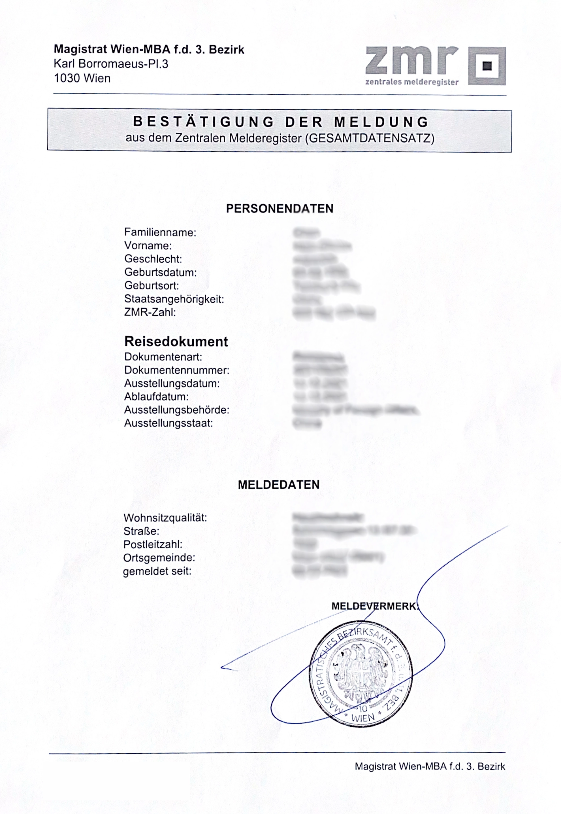

# 辦理入籍

入籍（德文：Anmeldung）是每個人第一次搬到奧地利時需要做的動作，在入住[新居住地的三天內](https://www.wien.gv.at/amtshelfer/dokumente/verwaltung/meldeservice/anmeldung.html)要完成這項手續，這項手續是免費的。

## 入籍需要文件

入籍前，你需要準備好下列文件：

- [ ] 護照正本
- [ ] 登記表

:::tip 好用工具

用 [**Todoist**](https://get.todoist.io/3d1vczem1yso) 規劃追蹤你的 To-do 清單。

:::

登記表（德文：[Meldezettel](https://www.stadt-wien.at/wien/soziales-buerokratie/meldezettel.html)，英文：registration form）你可以自己列印出來、或是在任一區公所領取，也有可能房東在交屋的時候會直接交給你。

填完這張 Meldezettel 後，必須找房東簽名，才可以到區公所順利辦理入籍。

## 尋找區公所 

入籍沒有規定你一定要在你所居住該區的區公所，任一個區公所都有提供此服務，這項服務叫做 Meldeservice，你可以在入籍前上網預約時間，或是直接當場領號碼牌等候叫號也可以。

:::tip 怎麼知道我住在第幾區？

透過你的郵遞區號四碼的中間兩個數字，就是你住的區號喔！

例：1010，就是第一區。

:::

好用連結：
- [位在維也納的區公所](https://www.wien.gv.at/mba/mba.html)

:::caution 你是台灣人！

奧地利政府一直以來都是偏向親中的立場，所以台灣人的國籍很容易被打成 China，在入籍的時候也是。

在填 Meldezettel 的時候國籍應該直接填寫 Taiwan 而非 Republic of China，在工作人員填資料時也要口頭提醒他們，減少出錯的可能性。

在維也納，有某些區（像是第三區）的公所應該是懶得幫你手動輸入，就是會在國籍選 China 而且也不幫你改，所以建議就不要去第三區的公所辦理入籍了。

目前已知第二十區的公所都會願意幫我們填入 [Taiwan]，如果入籍時遇到國籍問題推薦大家去那邊～

:::

## 入籍證明範本

入籍完成後，你就會拿到一張 Bestätigung Der Meldung，證明你已經入籍成功。

