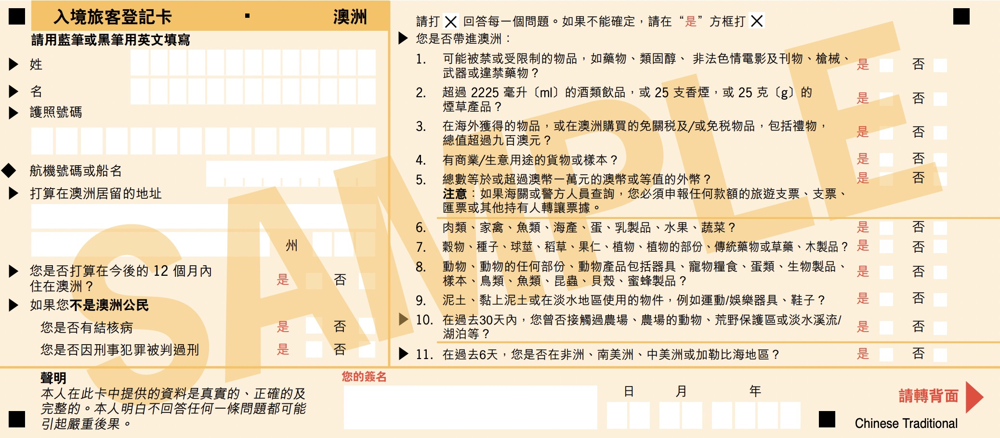
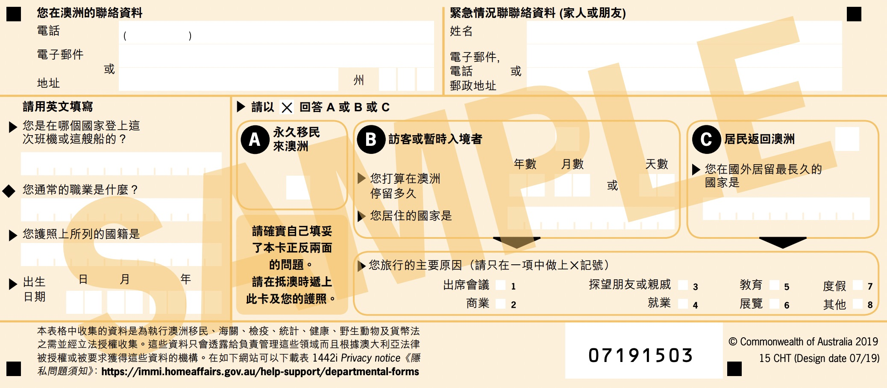

# 澳洲入境規定

所有赴澳洲之旅客，除了紐澳公民以外都**需要簽證才能入境**，且需填寫入境卡。

如在澳轉機時間為同一天，**且**轉機時間少於 8 小時，**且**抵達澳洲後無須入境辦理登機或行李提領托運，可適用澳洲[「無簽證過境」（TWOV）](https://immi.homeaffairs.gov.au/visas/getting-a-visa/visa-listing/transit-771/travellers-eligible-to-transit-without-visa)。未符上述情形（轉機時間超過8小時、非在同一天、或須入境澳洲），則應於行前辦妥澳洲過境簽證（簽證類別 771 號）或持有效期限內之 ETA（簽證類別 601 號）。

## 澳洲觀光簽證種類

### 澳洲 ETA （601 號）簽證基本資訊

- 簽證種類：觀光簽，又名 601 號簽證
- 簽證有效期：一年
- 停留期限：每次不超過 3 個月
- 申請費用：澳幣 20 元

澳洲[簽證類別 601 號](https://immi.homeaffairs.gov.au/visas/getting-a-visa/visa-listing/electronic-travel-authority-601#Eligibility)也叫做 ETA（Electronic Travel Authority，旅遊電子許可）。持有 ETA，可以在一年內數次入境澳洲，每次在澳洲最長停留 3 個月。

#### 申請 ETA（601 號）簽證

申請 ETA，你必須要：
- 在澳洲國土外（抵達澳洲前）申請
- 持有有效護照
- 使用澳洲 ETA App 手機應用程式申請
    - iPhone 用戶下載：[App Store ios](https://apps.apple.com/au/app/australianeta/id1527982364)
    - Android 用戶下載：[Google Play Store](https://play.google.com/store/apps/details?id=au.gov.homeaffairs.eta&hl=en_AU&gl=US&pli=1)
- 申請費用 20 AUD 澳幣

更詳細的 ETA 申請步驟，請[參考官方手冊（英文）](https://immi.homeaffairs.gov.au/supporting/files/australian-eta-app-industry-guidance.pdf)。

### 澳洲過境 （711 號）簽證基本資訊

- 簽證種類：過境簽，又名 711 號簽證
- 簽證有效期：單次
- 停留期限：抵達澳洲後 72 小時內離境
- 申請費用：免費

澳洲[簽證類別 711 號](https://immi.homeaffairs.gov.au/visas/getting-a-visa/visa-listing/transit-771/travellers-eligible-to-transit-without-visa)也叫做過境簽證。

#### 如何申請過境（711 號）簽證

申請 ETA，你必須要：
- 在澳洲國土外（抵達澳洲前）申請
- 持有有效護照
- 在澳洲轉機，並持有 72 小時內前往下一個目的地的旅行證明（如機票）

## 澳洲入境卡

旅客入境澳洲需填寫入境卡，以下為官方提供之中文翻譯範本，供填寫時參考。

正面：

背面：

## 詳細資訊

更多和入境澳洲的相關規定可向澳洲辦事處洽詢。

澳洲辦事處：
- 地址：臺北市松高路 9-11 號 27-28 樓（統一國際大樓）
- 電話：02-8725-4100
- [官方網站](https://australia.org.tw/tpeichinese/home.html)

資料來源：
- [ETA 官網頁面](https://immi.homeaffairs.gov.au/visas/getting-a-visa/visa-listing/electronic-travel-authority-601#HowTo)
- [無簽證過境官網頁面](https://immi.homeaffairs.gov.au/visas/getting-a-visa/visa-listing/transit-771/travellers-eligible-to-transit-without-visa)
- [過境簽證官網頁面](https://immi.homeaffairs.gov.au/visas/getting-a-visa/visa-listing/transit-771)