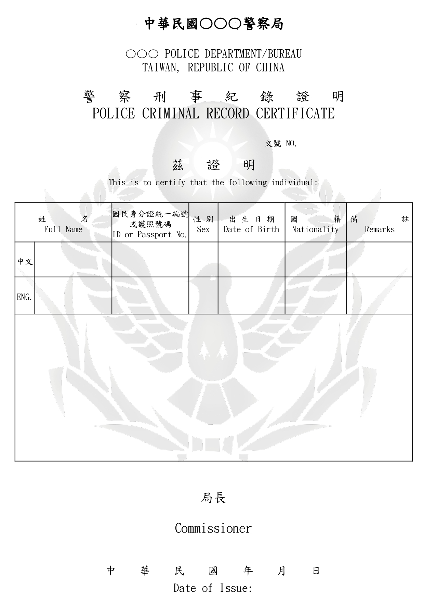

# 申請良民證

警察刑事紀錄證明，俗稱良民證，是申請人向各直轄市、縣（市）政府警察局申請個人有無刑案紀錄之證明。

## 誰需要良民證？

對於準備要長期待在國外，正在申請相關簽證、長期居留文件等的台灣人，可能會需要申請良民證。

有不少國家在需要提交的文件中，會要求必須要包含良民證。

## 良民證範本

## 如何申請良民證？

申請良民證的方法有三種，包括：

1. 臨櫃申請，臨櫃領證
2. 網路申請，臨櫃領證
3. 網路申請，郵寄領證

根據過往經驗，第二種方式是簡單明瞭：網路申請，臨櫃領證。

:::caution 注意事項

- 如需英文，在申請時請在「是否申請英文證書」勾選「是」。
- 未成年（未滿 18 歲）者，應由其法定代理人代為申請。

:::

### 準備文件

- [ ] 申請書
   - [ ] 網路申請者：[網路填寫申請書](https://eli.npa.gov.tw/E7WebO/index01.jsp)
   - [ ] 臨櫃申請者：[下載紙本影印](https://eli.npa.gov.tw/E7WebO/download/f1614333032246.pdf)
- [ ] 台灣國民身分證正本和影本各一份（或戶口名簿正本和影本各一份，並須出示有相片之證件）
- [ ] 護照影本一份，供英文拼音參考
- [ ] 申請費：新台幣 100 元，同時申請兩份以上，第二份起每份新台幣 20 元
- [ ] 如委託他人申請，必須填妥委託書（[點我下載](https://eli.npa.gov.tw/E7WebO/download/f1614332999234.pdf)）

## 良民證在哪裡申請？

各直轄市、縣（市）政府警察局均可受理申辦，不受戶籍地限制。

## 申請良民證要多久？

申請完成，2.5 至 3 個工作天後（30 天內）可以到指定（或臨櫃申請）警局繳費領件。

如欲確認申請進度，可以到警政署全球資訊網警察刑事紀錄證明網路申請系統[案件進度查詢](https://eli.npa.gov.tw/E7WebO/E701A01Q_01.jsp "前往 案件進度查詢 [另開視窗]")，輸入身分證字號與出生日期，即可查詢案件目前的申辦進度。

資料來源：[我的 E 政府](https://www.gov.tw/News3_Content.aspx?n=2&s=371569&lep=1&dailylife=1#)、[內政部警政署](https://www.npa.gov.tw/ch/app/folder/600)

