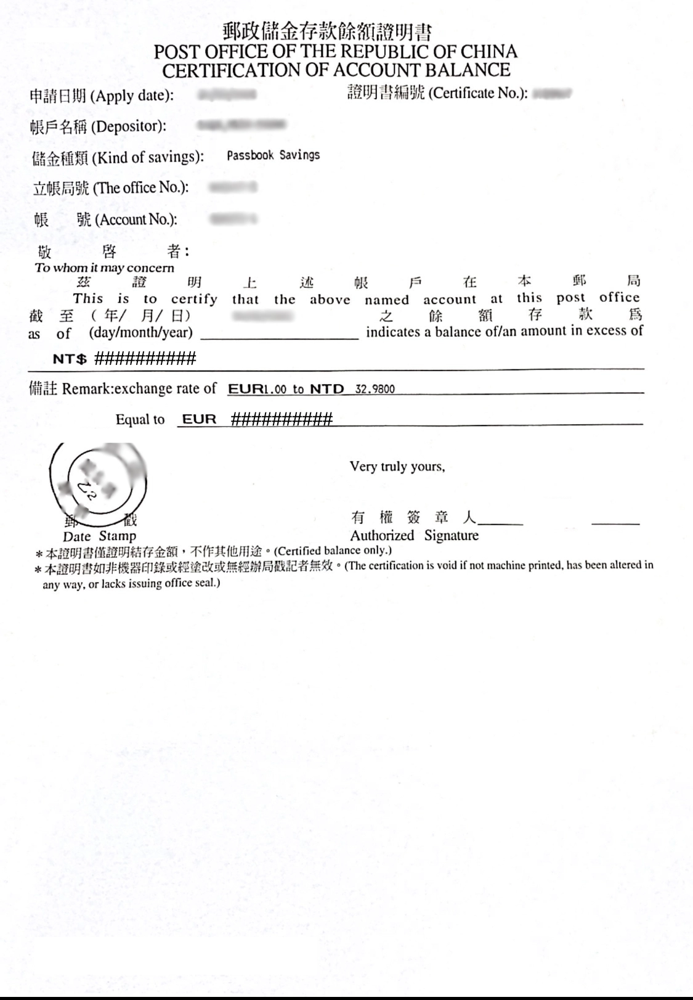

# 申請郵局＆銀行英文版財力證明

## 誰需要申請郵局＆銀行英文版財力證明？

如果你的旅途中會要申請簽證、有租屋的需求、又或是純粹想要一個護身符來降低被遣返的風險，都可以申請一張英文版的財力證明。

通常需要財力證明的原因，都是為了確定你待在國外的期間有基本的金援來維持生活。

財力證明雖然有[分很多種類](https://rich01.com/how-apply-financial-power-proof-tw/)，甚至有些人用存摺影本就能成功過關。不過最直觀的財力證明還是向**銀行或郵局申請的存款證明**。

## 如何申請財力證明

申請財力證明要攜帶的文件大同小異，包括以下：
- [ ] 申請表（通常於臨櫃拿取）
- [ ] 本人身分證
- [ ] 原留印鑑（通常本人親自臨櫃申請，得以簽名代替）
- [ ] 儲金簿／存摺
- [ ] 攜帶護照供參考譯名
- [ ] 申請費用一份約 20 ~ 100 台幣（少部分銀行免費提供服務）

:::caution 注意事項

1. 記得**一律**申請英文版或中英對照版本財力證明。
2. 通常財力證明效期為 3 個月，如申請時間已超過 3 個月，建議重新申請一次。
3. 存款餘額證明都是申請**前一天的餘額**，今天申請的是昨天的餘額，請提早至少一天將錢存進去要申請證明的戶頭。

:::

## 郵局財力證明

申請郵局財力證明需要準備的東西和銀行沒什麼不同，要特別注意的是，如果是本人親自臨櫃申請，**原留印鑑不是必須**！有些行員搞不清楚會堅持要原留印鑑，只要請他拿出申請表，查看最下方的注意事項就有寫到本人親自申請可以用簽名代替囉！

### 郵局財力證明申請表範本

### 郵局財力證明範本

## 申請郵局＆銀行英文版財力證明要多久？

臨櫃申請郵局＆銀行英文版財力證明基本上在一天（工作天）內就可以搞定，如果銀行是透過掛號信來送件的話就建議可以抓一個禮拜左右的時間最為保險。