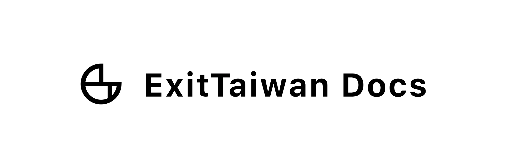

# ExitTaiwan Docs 首頁

> 「出國不應該是件這麼難的事情！」

我們志在提供台灣人一個整合式、完全免費的開放資訊平台，讓你可以只靠自己的準備，一圓出國的夢想。

在 ExitTaiwan Docs 的網站上，我們針對每個國家，用專案為導向的方式整理資料，包括「交換學生」、「留學」、「打工度假」、「工作」等。從「[**選擇國家**](/選擇國家)」的頁面開始，就可以照著步驟把所有需要辦理的事項完成。

我們把大多數台灣人在出國過程的某個階段可能會需要的資源，全部都集中整理放在了「[**好用資源**](/好用資源)」，這裡你會找到**各國的入境規定**、**常用的證件申請流程**、**推薦優惠**、**好用工具等**相關資訊。

:::note 免責聲明

本網站之所有內容僅供參考，如有出入請依照官方聲明、網站為主。

如內容過時、有誤等，歡迎來信告知：contact@exittaiwan.com。

:::
